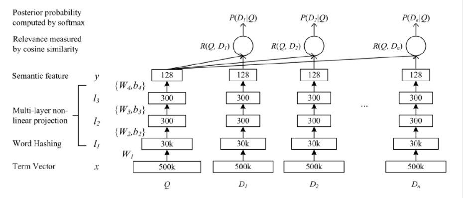
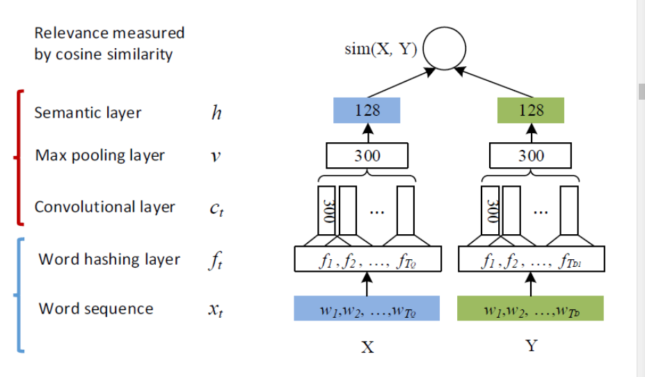

# DSSM:深度语义匹配模型

## 背景介绍

NLP的一个核心任务是计算语义相似度，在一个搜索场景下Query和Doc的语义相似度等，DSSM模型是解决这个问题提出的模型

语义相似度问题，最终归结于两个问题

* 召回:输入query，搜索引擎进行query理解，得到一个个独立的term，根据term到倒排索引中进行查找就完成了召回，每个term都会查询倒排，决定如何召回我们引入了一下策略
  * 召回截断，关键词分为不同的term，权重不同，每个term查询的倒排索引都会有一个倒排链，基于每个倒排索引定制一个召回分数，根据权重和召回分数的大小进行截断
  * 性能开销，减少返回的Doc，取交集
  * 以上为传统基于词的召回，不能解决**语义匹配**的问题
  * 为了解决语义匹配的问题，我们引入基于向量的语义召回
* 排序，有的时候语言表面上的细微变化会导致语义上的巨大变化，此时采用词匹配会产生不准确的结果

## DSSM深度语义匹配模型

### 功能

* 预测两个句子的语义相似度
* 获得某句子的低维语义向量表达

### 体系结构

* 输入层(Query,Title)
* 表示层(Query,Title)
* 匹配层(shared)

### 输入层

将句子映射到向量空间，作为DNN的输入，中文和英文的处理有这很大的不同

#### 英文

基本方法是word hashing,因为具有以下好处，使用letter-trigams

* 可以减少向量维度
* 冲突率很小(不同词映射到一个vector)
* word-hashing体现了词的前缀后缀等信息，某种意义上反映了词的语义

#### 中文

中文分词结果不可控，采取中文的最小粒度"单字"，字向量是独热码

### 表示层

采用bag of word的方式，抛弃了字向量的信息，query得到了一个包含所有word mapping vector的集合，实际上是多层全相联的神经网络

500k,30k,300,128指的是每一层向量的维度，$W_i$表示第i层的权值矩阵，$b_i$表示第i层的bias项，$l_i$为第i层网络的输入向量，我们有

$$\\ \\l_1=W_i x \tag{1}$$

$$\\ l_i=f(W_i l_{i-1}+b_i)\tag{2}$$

$$\\ y=f(W_N l_{N-1}+b_{N}) \tag{3}$$

$f(x)$使用$tanh$ $$f(x)=\frac{1-e^{-2x}}{1+e^{-2x}}$$

###  匹配层

计算语义向量的余弦相似度，衡量Query和Doc的语义相似性 $$R(Q,D)=cosine(y_Q,y_D)=\frac{y_Q^T y_D}{||y_Q||||y_D||}$$

使用softmax函数，将语义相似性转化为后验概率

$$P(D^+|Q)=\frac{exp(\gamma R(Q,D^+))}{\sum_{D_r\in D}exp(\gamma R(Q,D_r))}$$

我们的目标是通过极大似然估计，最小化损失函数

$$L(\Alpha)=-\log {\prod_{(Q,D^+)}P(D^+|Q)}$$,具体地说就是通过随机梯度下降SGD的方法使得模型收敛

## 优缺点分析

### 优点

采用字向量作为输入可以减少切词的依赖，提高模型的泛化能力，复用每个汉字表达的语义。传统的语义匹配模型中采用的是Embedding方式直接做词的映射，属于无监督的训练，给整个模型引入误差

### 缺点

词袋模型，损失语义信息(采用高维张量？)

## CNN-DSSM

### 输入层

#### 英文

增加了word-trigram，使用一个大小为三个词的滑动窗口，将每个词做letter-trigram并拼接到一起

#### 中文

字向量

### 表示层

卷积神经网络

#### 卷积层

提取滑动窗口的上下文特征，假设输入是一个$302\times 90000$的矩阵，代表302个字向量，每个字向量有90000维，卷积层是一个$3\times 90000$的权值矩阵，卷积核以步长为1向下移动，得到feature map为$300\times 1$的矩阵，得到了300个$300\times 1$的feature map矩阵

#### 池化层

#### 全连接层

(缺少CNN的基础，之后再来补)

## 问题

* 中文匹配使用one-hot编码的方式进行字编码是否会损失较多的语义信息
* DNN设置为多少层比较合适
* 查看大部分资料,DNN中$l_2,l_3$层神经元数目都是300，这样设置是performance和resource的tradeoff还是另有考虑