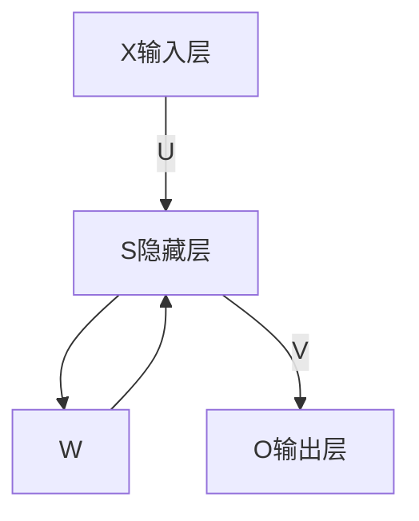

# Recurrent Neural Network

## natural language

* know which slot does a word belong to
* input a word into a network
* represent the work into vector

### word to vector

* one-hot encoding
* What about other world?
  * add a other in dimension
  * word hashing
* output is the possibility which slot the word belongs to

### some questions(nearby word may influence its meaning)

* 为神经网络增加记忆力
* Recurrent Neural Network
  * The output of hidden layer are stored in the memory
  * The value store in the memory and input will decide the output concurrently
  * give the memory initial value
* $x_1$ input into RNN and output $y_1$ temp value $a_1$
* $a_1$ and $x_2$ decide $y_2$ and $a_2$

## Jordan Network and Elman Network

* Elman Network: store hidden layer value
* Jordan Network: store hidden layer output
* Bidirectional RNN: different sequence

## Long short-term Memory

* Memory cell instead of common cell
* Input gate: when the gate is open, value can be written into Memory cell
* Output gate: when the gate is open ,value can be input into network
* Forget Gate: when to forget the Memory
* Gate is controlled by other part of network
* input is processed by sigmoid function
* $c^*=g(z)f(z_i)+cf(z_f)$ renew memory
* Need 4 times parameter

## network structure

* The layer has n neutron cell
* input size is m $x^t$ is the input vector
* We have 4 Matrix belong to $R^{m\times n}$
  * input matrix $In$ $z=In\times x^t$ is the input to neutron network
  * input gate Matrix $z^i$ $z^i\times z$ is input gate control
  * forget Matrix $z^f$ $z^f\times z$ is forget gate control
  * output Matrix $z^o$ $z^o\times z$ is output gate control 
* Add $h^t$ use hidden layer output

## How does RNN learn

* Training data(word classify): I arrive Taipei on November 2nd
  * We want to add label to each word
  * Design a Loss function
  * BPTT(Backpropagation through time)
* RNN training is difficult
* clipping 

___

## Other Materials

### 语言模型

给定一个一句话前面的部分，预测接下来最有可能的一个词是什么，本质上，语言模型是对一种语言的特征进行建模，在语音转文本(STT)对于输出结果选择最有可能的候选词

在RNN之前，语言模型采用的是n-GRAM，假设一个词出现的概率只与前面n个词有关，但是实际上决定这个词是什么的可能是之前很远的一个词

### RNN

#### 体系结构

* S,X,O均为向量，代表输入层，隐藏层，输出层的值
* U是输入层到隐藏层的权重矩阵，V是隐藏层到输出层的权值矩阵
* W为权重矩阵，是隐藏层上一次的值作为这一次输入的权重

#### 更新过程

* $$O_t=g(V\times S_t)$$
* $$S_t=f(U\times X_t+W\times S_{t-1})$$

