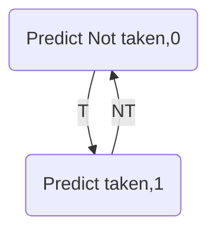

# 计算机体系结构——分支预测方法

## Overview

* 控制对性能的影响
* 基于分支历史表的预测
* 基于分支目标缓存

## 为何采取分支预测

* 精确处理中断
* 硬件循环展开
* 处理分支

### 异常处理

* 前面指令出现异常，乱序执行后面的指令已经写回
* 需要回滚寄存器文件状态
* 精确中断
  * 返回地址为：地址前面的指令都已经完成，并且后面的指令还没有完成
* 实现精确异常-提交点技术
  * 乱序执行，顺序提交(Reorder Buffer)
* 分支：动态分支预测
  * 分支预测错误
    * 流水线多个功能段被浪费
    * 可能造成程序执行结果发生错误
    * 不能破坏存储器和通用寄存器的内容
  * Reorder Buffer
    * 分支错误清空reorder buffer

### 动态分支预测/静态分支预测

动态分支预测基于转移的历史

## 分支预测

### 分类

* 基于BHT表
  * 2-bit预测器
  * 关联预测器-2级预测器
* 位于取值阶段

### 基本结构

* 输入
  * 转移历史，转移指令的PC
  * 根据转移实际结果更新预测其的状态信息
* 输出
  * 预测值->由分支预测器的状态决定

## 动态分支预测

* 预测分支的方向在程序运行时刻动态决定
* 主要问题
  * 记录转移历史信息
  * 根据转移历史信息，预测转移的方向
* 主要方法
  * BPB/BHT
  * 优化取指令带宽

### 1-bit BHT

#### 术语

* Not taken/taken
* 预测准确率/预测错误率

#### 分支历史表

* 分支指令的PC**低位索引**
* 指令转移表大小影响预测效果
* 记录上一次转移是否成功

#### 状态机

分支预测错误和初始状态有关

### 2-bit预测器

### Correlating Branch Predictor

* 分支预测器根据其它分支的行为进行预测
* b1不跳转跳转则b2不跳转
* 假设d在0、2间切换，预测错误率100%->每个跳转指令拥有互相独立的状态机预测跳转情况

#### 基本思想(1,1)

* 一位作为correlation位，记录**最近一次执行的分支**，一位为基本预测器位数
  * 当前指令/其它指令，**不一定是同一条指令**
* 根据最近一次转移的情况，选择不同的预测器(一共有两种)
* 一般的表达是(m,n)，根据最近的m个分支，从$2^m$个分支预测器中选择预测器，每个预测器的位数是n

| Prediction bits | Prediction if last not taken | Prediction if last taken |
| --------------- | ---------------------------- | ------------------------ |
| NT/NT           | NT                           | NT                       |
| NT/T            | NT                           | T                        |
| T/NT            | T                            | NT                       |
| T/T             | T                            | T                        |

### 竞赛预测器

全局历史预测器&&局部预测器竞赛，通过选择器选择分支预测器

## 基于BTB的分支预测

### 基本思想

分支指令的地址作为BTB的表项索引，得到分支预测地址

* 检查分支指令地址是否匹配
* 从表中得到预测地址
* 分支方向确定后，更新预测的PC->预测成功的开销可以降到0

### 流程

1. 发送PC低位到BTB表
2. 判断是否命中，BTB相当于一个缓存
   1. BTB未命中
      1. 如果不是分支指令，就正常执行
      2. 如果是分支指令并且转移成功，替换BTB表项
   2. BTB命中
      1. 根据预测PC地址修改PC
      2. 判断是否真正发生跳转
         1. 预测出错-将这个entry从BTB中删除

