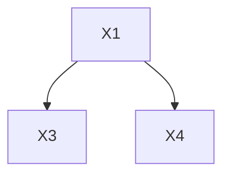
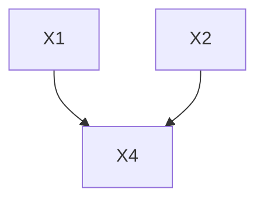
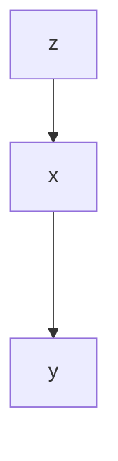

# Machine Learning——Bayes Divider

## 贝叶斯决策论

在所有相关概率均为一致的前提下，贝叶斯决策论考虑如何基于这些概率和误判损失选择最优的类别标记

### 数学描述

假设存在N种可能的类别标记，即$Y=\{c_1,c_2,...,c_N\}$,$\lambda_{ij}$是将一个真是标记为$c_j$的样本误分类为$c_i$所产生的损失，基于后验概率$Pr(c_i|x)$可以获得样本x误分类为$c_i$产生的寄望损失，即在样本x上的条件风险为

$$R(c_i|x)=\sum_{j=1}^N \lambda_{ij}P(c_j|x)\tag{1}$$ 

$R(c_i|x)$表示x为第i类的情况下分类错误的期望损失

分类任务要求寻找一个判定准则h:$X|->Y$最小化风险

$$R(h)=E_x[R(h(x)|x)]\tag{2}$$

对于每个样本x，若h能最小化最小风险$R(h(x)|x)$，则总体风险也会被最小化，提出贝叶斯判定准则:最小化总体风险，只需要在每个样本上选择能使条件风险$R(c|x)$最小的类别标记，即

$$h^*(x)=argmin_{c\in Y}R(c|x)\tag{3}$$

此时$h^*$称为最优贝叶斯分类器，与之对应的总体风险$R(h^*)$称为贝叶斯风险，它在一定程度上反映了分类器所能达到的最优性能，是Machine Learning模型的精度上限

若$\lambda_{ij}=I(i\neq j)$，条件风险与最小化分类错误率可以写成

$$R(c|x)=1-P(c|x)\ h^*(x)=argmax_{c\in Y}P(c|x) \tag{4}$$

实际工作中，后验概率不易获得，我们使用贝叶斯公式求条件概率

$$P(c|x)=\frac{P(c)\times P(x|c)}{P(x)}\tag{5}$$

说明

* $P(c)$先验概率
* $P(x)$证据因子
* $P(x|c)$样本$x$相对于类标记$c$的类条件概率，称为似然，我们要估计的是类条件概率

## 极大似然估计

### 基本思想

假设类条件概率具有某种确定的概率分布形式，基于训练样本对概率分布的参数进行估计

假设关于类别c的类条件概率为$P(x|c)$被参数$\Theta_c$唯一确定，我们要用训练集D估计参数$\Theta_c$

### 极大似然估计

令$D_c$表示训练集D中的第c类样本组成的集合，假设这些样本为独立同分布，则$\Theta_c$对于数据集$D_c$的似然为

$$P(D_c|\Theta_c)=\prod_{x\in D_c}P(x|\Theta_c)\tag{6}$$

一般采取对数似然

$$LL(\Theta_c)=\log P(D_c|\Theta_c)=\sum_{x\in D_c}\log P(x|\Theta_c)\tag{7}$$

最大似然估计可以写为

$\hat{\Theta_c}=argmax_{\Theta_c}LL(\Theta_c)\tag{8}$

## 朴素贝叶斯分类器

### 基本假设

属性条件独立性假设：已知类别，假设所有属性相互独立，每个属性独立地对分类结果发生影响，重写贝叶斯公式

$$P(c|x)=\frac{P(c)P(x|c)}{P(x)}=\frac{P(c)}{P(x)}\prod_{i=1}^d P(x_i|c)\tag{9}$$

### 判定准则修改

$$h_{nb}(x)=argmax_{c\in Y} P(c)\prod_{i=1}^d P(x_i|c)\tag{10}$$

其中，先验概率$P(c)$可以根据实验得到

$$P(c)=\frac{|D_c|}{|D|}$$

假设$D_{c,x_i}$表示$D_c$中在第i个属性上取值为$x_i$的样本组成的集合，则条件概率$P(x_i|c)$表示为

$$P(x_i|c)=\frac{|D_{c,x_i}|}{|D_c|}$$

连续样本可以假设一个概率分布

存在问题：测试数据集中的某个数据没有在这个类中出现过，这样可能导致计算出的相对概率为0

## 半朴素贝叶斯分类器

问题：实际上各个属性独立的条件不一定成立，不能忽略一些比较强的属性依赖。

### 独依赖估计

基本假设：每个属性在类别之外最多依赖于一个其它属性，$pa_i$为属性$x_i$的父属性

$$P(c|x)=\alpha P(c)\prod_{i=1}^d P(x_i|c,pa_i)$$

### 确定父属性

* 方案一：假设所有属性均依赖同一个属性，称为超父
* 方案二：TAN在最大带权生成树算法的基础上，将属性关系抽象为一个树

#### TAN构造属性依赖树的过程

1. 计算任意两个属性之间的条件交互信息$I(x_i,x_j|y)$
   1.  $I(x_i,x_j|y)$刻画了属性$x_i,x_j$在已知类别的情况下的相关性
   2. $$I(x_i,x_j|y)=\sum_{c\in Y}P(x_i,x_j|c)\log \frac{P(x_i,x_j|c)}{P(x_i|c)P(x_j|c)}$$ 如果在某个属性下完全条件独立，那么它们的计算结果为0
2. 以属性为节点构造完全图 ,任意两个节点之间的边权重为$I(x_i,x_j|y)$
3. 构造此完全图的最大带权生成树，将边设置为有向边，保留了强相关属性之间的依赖关系
4. 加入类别节点(标识属性已知属于哪一类)

#### AODE

将每个属性作为超父属性，将具有足够训练数据支撑的SPODE集成起来作为最终结果

$$P(c|x)=\alpha \sum_{i=1,D_{x_i}\geq \hat{m}}^d P(c,x_i)\prod_{j=1}^d P(x_j|c,x_i)$$

本质上还是计数的过程，在训练数据集上对复合条件的样本进行计数的过程。

## 贝叶斯网

### 基本思想

* 使用有向无环图刻画属性之间的依赖关系
* 使用条件分布表表示属性的联合分布
* 假设每个属性和它的非后裔属性独立

### 三种基本结构

#### 同父结构

#### V型结构

$x_1,x_2$独立,给定$x_4$的取值，$x_1,x_2$不独立，若$x_4$取值未知，则$x_1,x_2$相互独立的

#### 顺序结构

### 贝叶斯网的学习

