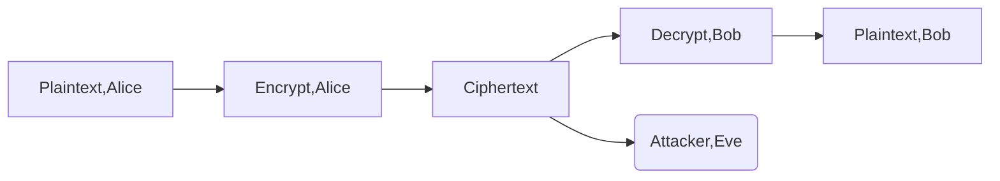
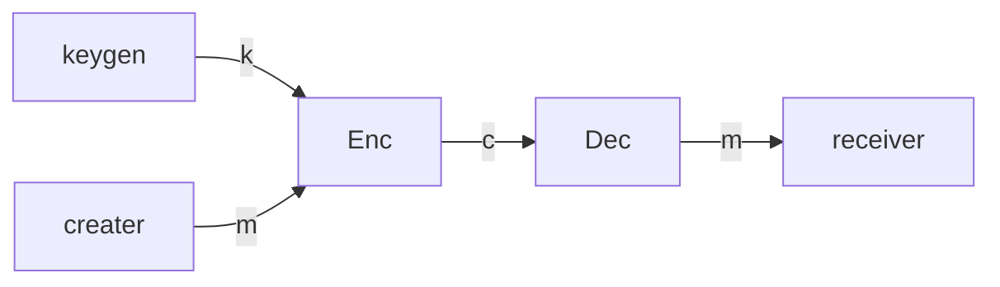

# 数据隐私方法伦理与实践——密码学

## History of Cryptography

### Basic Model

* Alice must have some information that Eve doesn't have

### Kerckhoff Principle

加密算法的安全性不是建立在算法对于攻击者是保密的，而是建立在所选择的密钥对于对手是保密的

* 算法公开
* Open Cryptographic Design

### 加密-解密基本流程

### Caesar Cipher

let $k,x,y\in {0,1,...,25}\ Encryption:y=e_k(x)=x+k mod\ 26\\ Decryption x=d_k(y)=y-k mod\ 26$

### Affine Cipher 仿射变换

$$let \ k,x,y\in {0,1,...,25}\ Encryption: y=e_k(x)=ax+bmod \ 26 \\ Decryption:x=d_k(y)=a^{-1}(y-b)mod \ 26$$

Requirement $gcd(a,26)=1$ Key Space:26

### Monoalphabetic  Substitution

Key Space 26!

Warning:单词频率攻击 Solution:一一对应改为矩阵 Flatten the distribution of letters

## 现代密码学

### 香农定理

(Gen,Enc,Dec)是一个对于编码空间M的加密方案，|M|=|K|=|C|，这个方案被称为完美加密当且仅当满足下列条件

1. 选择key $k\in K$按照等概率选取，选中的概率为$\frac{1}{|K|}$
2. $\forall m\in M \forall c\in C$,$\exists k\in K$ output c

### Vernam's cipher

* Enc(k,m$\in (0,1)^\lambda$)-> return $k\bigoplus m$
* Dec(k,c$\in (0,1)^\lambda$)-> return $k\bigoplus c$
* KeyGen ->  k<-$(0,1)^\lambda$

#### Correctness

Dec(k,Enc(k,m))=m

#### Security

对于任意两个明文$m,\hat{m}$，加密可能产生$Enc(k,m)=Enc(\hat{k},\hat{m})$(key is randomized gen)

加密结果等可能

#### 缺点

* 密钥太长 chicken-egg dilemma
* 通讯这如何在攻击者不知道的情况下交换一份密钥的拷贝

## The work of Whitfield Diffie & Martin Hellman

### Public key Cryptography

* one-way function:容易根据因变量算出函数，不能或者很难从函数算出因变量

### Classification of the field of Cryptology

### One-way function

