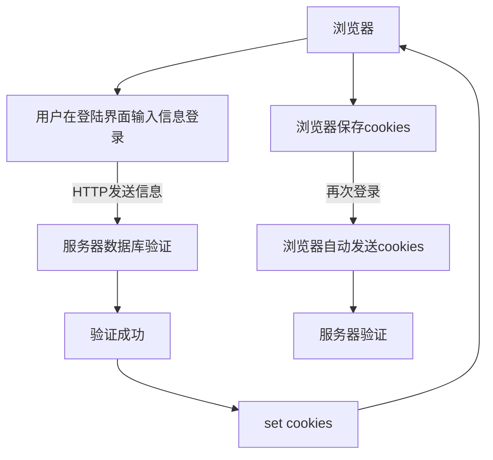

# Django教程

## 项目结构

`mysite/mysite`下有如下几个文件

* wsgi.py web网关的配置文件-服务上线需要用到
* urls.py 项目的主路由配置-HTTP请求进入Django时，优先调用该文件
* settings.py项目的配置文件，包含项目启动时所需要的配置

### setting.py

* 包含项目启动的所有配置项
* 公用配置与自定义配置
* 配置项格式: BASE_DIR='XXXX'(全局变量名必须是大写)

### Django如何处理一个请求

1. 用户发送HTTPS报文，请求Django站点的一个页面
2. Django加载该python模块并寻找可用的urlpatterns，它是django.urls.path()或django.urls.re_path()实例的序列
3. 按顺序遍历每个URL模式，会在请求的URL匹配到第一个模式后停止，并于`path_info`匹配
4. 一旦URL匹配成功，Django导入并调用相关的视图，这个视图是一个python函数，这个视图会获得
   1. 一个HTTPSRequest实例
   2. 如果匹配的 URL 包含未命名组，那么来自正则表达式中的匹配项将作为位置参数提供。
   3. 关键字参数由路径表达式匹配的任何命名部分组成，并由 [`django.urls.path()`](https://docs.djangoproject.com/zh-hans/3.2/ref/urls/#django.urls.path) 或 [`django.urls.re_path()`](https://docs.djangoproject.com/zh-hans/3.2/ref/urls/#django.urls.re_path) 的可选 `kwargs` 参数中指定的任何参数覆盖。
5. 如果没有 URL 被匹配，或者匹配过程中出现了异常，Django 会调用一个适当的错误处理视图。

## URL和视图函数

### URL

统一资源定位符，表示资源具体的位置，一般的语法[]可以忽略

protocol://hostname[:port]/path\[?query\]\[#fragment\]

* 协议 file是本地计算机上的协议
* 主机名 域名或者IP地址
* 端口，默认是80
* path主机上的路径
* query，给动态网页传递参数，可以传递多个参数用&隔开，名=值
* fragment，文档标签

### Django对URL请求的处理

输入地址`http://127.0.0.1:8000:/page/2003`

1. Django从配置文件中根据ROOT_URLCONF找到主路由文件，在项目同名目录下的urls，例如`mysite/mysite/urls.py`
2. Django加载主路由文件中的`urlpatterns`中数组，path方法指明地址，逐渐匹配，第一个参数
3. 匹配成功调用对应的视图函数处理请求得到相应，失败返回404

### 视图函数

#### 任务

接受一个HTTP请求，返回一个HTTP相应对象

#### 定义

```python
def viewname_view(request,otherparameter):
    return HttpResponse对象
```

request是HTTP请求

#### 位置

项目同名文件夹下`views.py`，实例

```python
from django.http import HttpResponse
def page1.view(request):
    html="<h1>This is first page</h1>"
    return HttpResponse(html)
```

注意还需要导入views.py模块

## 路由配置

### path(route,views,name=None)

* route 路由
* views 给定函数名
* 为地址起别名，模板中地址反向解析时使用

### 建立多个网页——网页匹配器

path转换器

#### 语法

\<转换器类型:自定义名\>

通过一个视图，转换器类型匹配到对应类型的数据，则将数据按照关键字传参的方式传递给视图函数，视图函数应该预留一个和自定义名类型相同的形参

#### 实例

`path('page/<int:page>',views.xxx)`

#### 转换器类型

| 转换器类型 | 作用                                                    |
| ---------- | ------------------------------------------------------- |
| str        | 匹配除了‘/’以外的非空字符串                             |
| int        | 匹配0或者任何正整数，传递给视图为int型                  |
| slug       | 匹配任意由ASCII字母或数字以及连字符和下划线组成的短标签 |
| path       | 匹配非空字符串，包括路径分隔符                          |

一个path内支持多个字符串

### re_path()转换器

采取正则表达式进行精准匹配

#### 语法

```python
re_path(reg,view,name=xxx)
```

正则表达式为命名分组模式(?P\<name\>pattern)，匹配提取参数后用关键字传参方式传递给视图函数

## Django-请求和相应

### 定义

* 请求:浏览器通过HTTP协议发送给服务器端的数据
* 相应是服务器端接收到请求后做相应的处理后回复给浏览器端的数据

### 请求

* 起始行
  * 路由
  * 方法: GET(请求特定的页面信息) POST(向服务端提交数据进行处理请求) HEAD(只需要响应头) PUT(更新服务器端的文档) DELETE(删除)8
  * 协议
* 请求头
  * key-value匹配对
* 请求体
  * 浏览器给服务器的数据

### Django中的请求

* 视图函数的第一个参数
* 接收http协议的请求后，根据请求数据报文创建httprequest对象
* `httprequest`对象具有一些属性和方法
  * `path_info` URL字符串
  * `method` 字符串，表示HTTP请求方法
  * `GET` QueryDict查询字典的对象
  * `POST` QueryDict查询字典的对象，包含post请求方式的所有数据
  * `FILES` 上传文件信息
  * `get_full_path()`查询的完整路径
  * `META`请求中的元数据(消息头)
    * `‘REMOTE_ADDR’ `客户端IP地址

### 相应

* 起始行
  * 状态码 302重定向
  * 状态码原语
* 响应头
* 响应体:数据

### Django中的相应对象

#### 构造函数

```python
HttpResponse(content,content_type,status)
```

* `content`响应体
* `content_type`响应体数据类型，默认HTML
* `status`状态码

#### `HttpResponse`子类

用于重定向等

## GET请求和POST请求

统一由视图哈按时接收请求，通过判断`request.method`区分请求

### GET请求

产生GET请求的场景

* 浏览器输入URL回车
* HTML中的超链接
* form表单中的method为get

#### GET处理

传递数据，使用查询字符串传递，格式为

```html
url?parameter1=value1 & parameter2=value2
```

#### 取得查询字符串的值

* `request.GET('参数名')`,可能导致keyerror
* `request.GET.get('参数名','默认值')` 当没有传递参数是赋给默认值
* `request.GET.getlist('参数名')` ，一个key对应多个value，用GET方法得到一个值

### POST请求

用于向服务器提交大量/隐私数据

#### 应用场景——表单

```html
<form method='post' action='/login'>
    name:<input type='text' name='username'>
    <input type='submit' value='login'>
</form>
```

给login发post请求，框德名称为username，表单的键为username

#### 处理

和GET相同，GET换成post

#### CSRF处理失败

POST请求需要按照一定规则，需要取消CSRF验证，禁止CsrfViewMiddleware中间件

## Django设计模式和模板层

### MVC和MTV

#### MVC(Model-View-Controller)

* 模型层用于对数据库层的封装:与数据库通信
* 视图层用于向用户展示结果(WHAT+HOW如何显示什么数据)
* 控制用于处理请求，获取数据，返回结果

#### MTV(Model-Template-View)

* Template模板层，负责呈现内容给浏览器(HOW,HTML)
* View视图层，负责接收请求，获取数据，返回结果(WHAT)
* 控制层只负责路由分发

### 模板

* 模板是可以根据字典数据动态变化的HTML网页
* 可以根据视图中传递的字典数据动态生成相应的HTML网页

### 模板配置

#### 创建模板文件夹\<项目名\>/templates，在settings.py中TEMPLATES配置项

* BACKEND指定模板的引擎
* DIRS模板的搜索目录
* APP_DIRS是否要在应用中templates文件夹中搜索模板文件
* OPTIONS有关模板的选项

实际上需要修改DIRS

#### 样例

'DIRS':[os.path.join(BASE_DIR,'templates)] BASE_DIR用于拼接生成路径

### 模板的加载方式

#### 通过loader获取模板，通过HttpResponse进行相应

1. loader加载模板
2. 将t转化为HTML字符串
3. 用相应对象将转换的字符串内容返回给浏览器

实例代码

```python
from django.template import loader
def test_html(request):
    t=loader.get_template('test.html')
    html=t.render()
    return HttpResponse(html)
```

#### 使用render直接加载并相应模板

```python
render(request,'html模板名',字典数据)
```

模板层需要拿到视图层的数据，下面介绍视图层与模板层的交互

### 视图层与模板层的交互

1. 视图函数可以将python变量封装到字典中传递到模板
2. 模板中使用{{变量名}}->实际上是key调用视图传递来的变量

## 模板层——变量与标签

### 模板的变量

* 通过render方法传给模板一个字典
* 传递到模板中的数据类型

#### 模板中的变量语法(传递函数不需要加括号)

* {{变量名}}
* {{变量名.index}}穿的是可迭代的对象
* {{变量名.key}}字典
* {{对象.方法}}返回调用方法之后的结果给模板
* {{函数名}}返回函数调用的结果

### 模板标签

#### 作用

将一些服务端的功能嵌入到模板中，例如流程控制

#### 标签语法

```txt


```

#### 例子：if标签

```html




```

模板中不能使用嵌套if,即if语句条件判断不能用括号

`locals()`方法可以将函数内的局部变量封装成一个字典

#### 例子：for标签

```html



```

empty仅当obj为空的时候使用

##### for标签内部变量forloop


## 模板层高级应用——过滤器与继承

### 过滤器

#### 定义

在变量输出时对变量的值进行处理

#### 作用

可以通过过滤器改变变量的输出显示

#### 语法

```html
{{ var|filter1:'para1'|filter2:'para2'...}}
```

#### 常用过滤器


html转义：将js代码以html文档形式呈现

### 模板的继承

#### 基本思想

模板继承可以使父模板的内容重用，子模板直接继承父模板的全部内容并可以覆盖父模板中相应的块

#### 语法

##### 父模板

* 定义父模板中的block块标签
* 表示出子模版中哪些部分允许修改
* block标签：父模板中定义，可以在子模版中覆盖

##### 子模板

* 继承模板extends标签，写在模板文件第一行
* 子模板重写父模板中的内容快

```html


```

#### 重写的覆盖原则

* 不重写，按照父模板的效果显示
* 重写，按照重写的效果显示
* 模板继承不能继承模板传递的变量(动态内容)

## URL反向解析

### 代码中URL的出现位置

#### 模板

##### 超链接

```html
<a href="url"></a>
```

##### 表单

```html
<form action="url" method='post>'
```

form表单中的内容提交给url，字段放在查询字符串

#### 视图函数

重定向跳转

```python
HttpResponseRedirect('url')
```

### 书写URL的规范

1. 绝对地址
2. 相对地址
   1. '/page/1' 需要以'/'开头，浏览器会将当前地址栏中的协议，ip和端口加上这个地址，作为最终访问地址
   2. 'page/1' 没有/开头，浏览器会根据导航前浏览器最后一个/之前的内容加上该相对地址作为最终访问地址

### URL反向解析

#### 概念

视图/模板中用path定义的名称动态查找或计算出相应的路由

#### path函数的第三个参数

```python
path('page',views.page_view,name='page_url')
```

#### 模板中通过url标签实现地址反向解析

```html


```

可以通过这种方式对path转换器传参，应对url变化的情况很有效

#### 视图函数中，可以调用django中的reverse方法进行反向解析

```python
reverse('别名',args=[],kwargs={})
```

302跳转发生时，服务器给浏览器发的响应头location中含有重定向的位置

## Django静态文件

### 什么是静态文件

图片，css，js，音频，视频

静态文件从服务器加载到浏览器，发送HTTP请求，从服务器上获取文件

### 静态文件配置——在`settings.py`中配置

#### 配置静态文件的访问路径(默认存在)

* 通过那个URL地址查找静态文件
* STATIC_URL='/static/'
* 指定访问静态文件需要通过`/static/xxx`或'http://127.0.0.1:8000/static/xxx'
* 静态请求的HTTP不走view

#### 配置静态文件的存储路径

STATICFILES_DIRS保存的是静态文件在服务器端的存储位置，是一个元组

```python
STATICFILES_DIRS=(os.path.join(BASE_DIR,"static"))
```

#### 通过标签访问静态文件

1. 加载static 
2. 使用静态资源 

## Django应用及分布式路由

### 什么是应用

应用在Django项目中的是一个独立的业务模块，可以包含自己的路由、视图、模板、模型。一个独立的文件夹

### 创建应用

1. 创建应用文件夹 python3 manage.py startapp music
2. 在`settings.py`中INSTALLED_APPS配置此应用(注册)
   1.  一个数组，含有创建好的应用

### 应用文件夹下的文件

* `models.py`模型层代码，负责与数据库交互
* `admin.py`管理后台
* `views.py`视图层代码
* `tests.py`测试

### 分布式路由

不需要将所有的路由放到主路由中，主路由不处理用户的具体路由，主路由配置文件可以做请求的分发(分布式请求处理)。具体的路由请求可以由各自的应用来处理

根据地址分析要看哪个应用，每个应用下的`urls.py`负责具体请求的相应


1. 主路由调用include函数
   1. include('appname.urlmodulename')
   2. 作用：用于将当前路由转到各个应用的路由配置文件的urlpatterns进行分布式处理
   3. http://127.0.0.1:8000/music/index 表示为 path('music/',include(music.urls))
2. 应用中创建`urls.py`,主路由已经匹配的部分不用管

### 应用内的模板

1. 应用下创建templates文件夹
2. `settings.py`中TEMPLATES配置项中 APP_DIRS为TRUE
3. 模板查找的顺序
   1. 优先查找外层templates目录下的模板
   2. 按照INSTALLED_APPS配置下的应用书讯逐层查找

## 模型层及ORM介绍

### 模型层

负责与数据库之间进行通信

### 模型

* 一个Python类，继承自`django.db.models.Model`
* 一个模型类对应一张表
* 模型类的每一个类属性对应数据库的一个字段
* 模型是数据交互的接口，表示和操作数据库的方法和方式

### ORM框架

#### 概念

Object Relational Mapping，对象关系映射，允许使用类和对象对数据库进行操作，从而避免通过SQL语句操作数据库

#### 作用

1. 建议模型类和表之间的对应关系，通过面向对象的方式操作数据库
2. 设计模型类生成数据库的表格
3. 简单的配置可以进行数据库的切换(数据模型和数据库的解耦，隐藏了数据之间的差异)

#### 映射关系

* 类——数据表
* 对象——数据行
* 属性——字段

models.xxxfield定义表中的字段

### 数据库迁移

* 迁移是Django同步对模型所作更改(添加字段，删除模型等)到数据库模式的方式
  * 生成迁移文件，执行`python manager.py makemigrations`
    * 模型下的`models.py`生成一个中间文件，保存至`migrations`文件夹下
  * 执行迁移脚本程序`python manager.py migrate`
    * 执行迁移程序实现迁移，将每个应用下的`migrations`目录的中间文件同步回数据库
* Django会自增一个id作为主键

### 模型类创建

```python
from django.db import models
class modelname(models.Model):
    字段名=models.字段类型(字段选项)
```

## ORM基础字段及选项

### 为数据表添加字段

任何关于表结构的修改，需要在模型层修改，在模型类添加一个类属性

### 字段类型

| mysql        | Model           | 含义       | 备注                                                   |
| ------------ | --------------- | ---------- | ------------------------------------------------------ |
| tinyint(1)   | BooleanField()  | 布尔类型   | 数据库中使用0/1表示具体的值，编程语言中使用True或False |
| varchar(n)   | Charfield       | 变长字符串 | 指定`max_length`参数                                   |
| date         | DateField()     | 日期       | 创建时间/更新时间                                      |
|              | DateTimeField() |            | 精确到小时分钟秒                                       |
|              | DeimalField()   | 小数       | 指定总位数与小数点位数                                 |
| Varchar()    | EmailField()    | 邮箱       | 设置正则表达式判断非法邮箱地址                         |
| Varchar(100) | ImageField()    |            | 保存图片的路径                                         |
|              | TextField()     |            | 不定长的字符串(评论等)                                 |

date参数


### 字段选项

* 指定创建列的额外信息
* 允许出现多个字段选项，需要用,隔开

常见字段选项

| 选项名       | 说明                                        |
| ------------ | ------------------------------------------- |
| primary_key  | 设置为True则这一列为主键                    |
| blank        | 设置为True可以为空，控制admin后台对表的处理 |
| null         | 插入时是否可以为空                          |
| default      | 默认值                                      |
| db_index     | 是否需要在当前字段添加索引                  |
| unique       | 唯一索引                                    |
| db_column    | 指定字段名，否则采取属性名作为列名          |
| verbose_name | 字段在admin后台上的显示名称                 |

### 模型类Meta类

#### 定义

内部meta类可以给模型赋予属性，Meta类下的内奸属性可以对模型类做控制

#### 实例——修改表名

```python
from django.db import models
class Book(models.Model):
    title=models.CharField("Bookname",max_length=50,default="New Book")
    price=models.DecimalField("Price",max_digits=7,decimal_places=2,default=0.0)
    bookinfo=models.CharField("Information",max_length=100,default='')
    class Meta:#注意定义的位置和名称
        db_table='book'#表名
```

## ORM基本操作

### 踩坑

makemigration出现如下错误，新添加字段没有default同时非空，旧数据不知道默认值


数据库迁移文件混乱，每次migrate只是执行增量文件——不执行已经执行的记录，执行过的记录保存在一个表中`django_migrations`，相当于日志，删除所有migrations里的所有迁移文件

### ORM创建数据

#### ORM基本操作

增删查改操作(CRUD)->核心在于模型类的管理器对象

#### 管理器对象

每个继承自`models.Model`的模型类，都会有一个`objects`对象被同样继承下来，这个对象称为管理器对象，增删查改通过管理器对象实现

#### 创建数据

##### 方案一

```python
MyModel.objects.create(attribute1=values1,attributes2=values2)
```

* 成功——返回创建好的实体对象
* 失败——抛出异常

##### 方案二——面向对象

使用模型类实例化对象，并调用save保存

```python
obj=MyModel(attribute1=value1,attribute2=value2)
obj.attribute=value
obj.save()
```

### Django Shell

交换环境，自动配置项目信息，代码出现变化，需要重新进入Django Shell

### Django查询数据

#### 简介

通过使用管理器对象进行，通过`MyModel.objects`管理器方法调用查询方法

#### 常见方法

##### all()

* 用法 `MyModel.objects.all()`
* 作用 查询某个表中的所有数据
* 等同于`select *`
* 返回值是一个QuerySet容器对象，每一个元素为数据库中的一行，要调用某个行中的某一列需要采取类似于调用类成员对象的方法
* 可以在方法中定义`__str__()`属性，修改输出格式

##### values('columns1','columns2',...)

* 用法 `MyModel.objects.values()`
* 作用 查询部分列的数据并返回
* 相当于 select columns1,columns2 from xxx
* 返回值是一个QuerySet，容器内存放字典，每个字典代表一条数据

##### values_list

与values基本一致，返回一个元组，会将查询到的数据封装到元组中，再封装到查询集合QuerySet中

##### order_by()

* 用法 `MyModel.objects.order_by('columns1','columns2')`
* 相当于order by语句
* 默认升序排序，降序排序需要在列前加上`-`
* 返回QuerySet
* 只要返回的是QuerySet就可以进行排序
* `Queryset.query`得到对应的QuerySet的SQL语句

#### 条件查询(等值查询)

##### filter(condition)

* 语法 `MyModel.objects.filter(attribute1=value1,attribute2=value2)`
* 返回包含条件的所有数据集，其中`,`相当于`and`
* 返回QuerySet容器对象，存放模型类实例
* 注意相等用`=`而不是`==`
* 只能适用于非等值查询

##### excude(condition)

* 语法 `MyModel.objects.exculude(condtion)`
* 返回不满足此条件的全部数据集
* 返回QuerySet

##### get(condition)

* 作用 返回符合条件的唯一一条记录
* 方法只能返回一个Model实例，多余一条记录满足条件抛出`Model.MultipleObjectsReturned`异常，没有的话返回`Model.DoesNotExist`

#### 查询谓词

* 做更灵活的条件查询需要用到查询谓词
* __谓词，前面为字段
* __contains='xxx'包含特定词
* __startwith以xx开始
* __gt大于
* __gte大于等于

### 更新操作

#### 更新单个数据

1. 查 `get()`
2. 改 `obj.attribute`
3. 保存`obj.save()`

#### 批量更新数据

`QuerySet`的`update`属性(单个数据的更新不能用`update`方法)

### 删除记录

#### 单个记录

1. `get()`获取对象
2. `delete()`删除

#### 批量删除

只需要对`QuerySet()`调用`delete()`方法删除

#### 伪删除

* 在表中删除一个字段`is_activate`
* 选择`is_activate=True`的数据进行过滤查询，删除只需要把这个表项改为`False`

## F对象和Q对象

### F对象

#### 定义

一个F对象代码数据库中某条记录的字段信息，并未把这个值取出来

#### 作用

* 通常对数据库中字段值在不获取的情况下进行操作
* 用于类属性字段之间的比较

#### 语法

```python
from django.db.models import F
F('column name')
```

用于对一列的元素采取同样操作，处理资源竞争问题(并发)

### Q对象

查询结果集使用复杂的逻辑或逻辑非等操作可以借助Q进行操作

## Django后台管理

### 什么是admin管理后台

* 提供了比较完善的后台管理数据库接口，供开发过程中调用和测试使用
* Django会搜集所有注册的模型类
* 创建最高权限账户`python manager.py createsuperuser`

### 将模型类注册到admin后台

* 在应用app中的`admin.py`中导入注册要管理的模型类
* 调用`admin.site.register`方法进行注册

### 模型管理器类

#### 作用

为后台管理界面添加便于操作的新功能

#### 插件化开发

后台管理器类需要继承自`django.contrib.admin`中的`ModelAdmin`类

#### 使用方法

* app/admin.py中定义模型管理器类
  * 类属性关联样式
* 绑定注册模型管理器类和模型类

#### 常用属性

| 属性名             | 功能                                               |
| ------------------ | -------------------------------------------------- |
| list_display       | 展示显示的字段                                     |
| list_display_links | 控制list_display中的字段，哪些可以被链接到修改页面 |
| list_filter        | 过滤器字段                                         |
| search_fields      | 设置搜索依据，进行模糊查询                         |
| list_editable      | 添加可在列表页编辑的字段                           |

### Meta模型类

内嵌类定义模型类的属性

## 关系映射

### 一对一

#### 创建模型类

* 现实事务间存在的一对一对应关系
* OneToOneField(类名，on_delete=xxx)
* On_delete表示级联删除->形成关系的数据删除的规则
  * `models.CASCADE`删除包含Foreginkey的对象
  * `models.PROTECT`抛出ProtectedError异常阻止被引用对象的删除
  * `SET_NULL`设置外键为Foreignkey=Null需要设置Null=True
  * 注意：字段名发生变化

#### 创建数据

有关联的外键类需要指定外键字段名(字段)或者类属性名(object)

```python
createobj=Model.objects.create(columns=values,related_obj=obj)
createobj=Model.objects.create(columns=values,related_column=column)
```

#### 查询数据

1. 正向查询

   通过外键查找关联的对象`Modelobj.relatedattribute.attribute`

2. 反向查询

   反向查询，没有外键，调用反向关联属性(Django自动创建)

### 一对多

#### 创建模型类

```python
class A(models.Model):
    
class B(models.Model):
    attribute=models.ForeginKye(A,ondelete=xxx)
```

```python
from django.db import models
class Publisher(models.Model):
    name=models.CharField("Name",max_length=50)
class Book(models.Model):
    title=models.CharField("Title",max_length=50)
    publisher=models.ForeignKey(Publisher,on_delete=models.CASCADE)
```

publisher是一个外键，关联到Publisher的外键

#### 创建数据

```python
#外键属性名
p1=Publisher.objects.create(name='')
b1=Book.object.create(title='',publisher=p1)
#外键字段名——值
b1=Book.object.create(title='',publisher_id=1)
```

#### 查询

##### 正向查询(Book->Publisher)

Book.publisher

##### 反向

引入反向属性

```python
#pub1 is an publisher object
books=pub1.book_set.all()
```

### 多对多

转化为第三张表，两个一对多，Django自动创建第三张表

#### 属性

```python
attribute=models.ManyToManyField(defclass)
```

#### 创建数据

```python
#a1,a2 is two onject
b1=a1.book_set.create(attribute)
a2.book_set.add(b1)
#book is an object
a3=book.authors.create(name='xxx')
book.authors.add(a1)
```


## Cookies和session

保持会话状态

### 什么是会话

* 打开浏览器访问一个网站，到关闭浏览器结束此次访问，称为一次会话
* HTTP协议是无状态的，导致会话状态难以保持
* Cookies和Session就是为了保持会话状态而诞生的两个存储技术

### Cookies

#### 特点

* 在浏览器上以键值对存储，键和值均为ASCII字符串
* 存储的数据带有生命周期
* 按域名存储隔离，不同域名之间无法访问
* cookies内部的数据会在每次访问该网址的时候都会携带到服务器端，如果cookies过大会影响性能
* 服务端解读cookies，分发cookies给用户

#### 存储

```python
HttpResponse.set_cookie(key,value)
```

#### 获取

```python
request.COOKIES.get['key','default_value']
```

获取字典

### cookies登录/会话保持流程



### session

#### 定义

保存状态信息到服务器上，针对不同浏览器(客户端)，设置独立的存储空间，返回存储空间标识(相应)

#### 实现

1. 使用session需要在浏览器启动cookie，在cookies中存储sessionid
2. 每个客户端与服务器有独立的session
3. 存储session的空间独立

#### 使用

session类似于字典的SessionStore对象，可以用类似字典的方式操作

1. 保存session到服务器 `request.session['KEY']=VALUE`
2. 获取session的值 `value=request.session.get('key','default')`
3. 删除session `del request.session['key']`

#### session配置

1. SESSION_COOKIE_AGE设置session保存时长
2. SESSION_EXPIRE_AT_BROWSER_CLOSE=True只要浏览器关闭session就失效
3. session存在数据库中，需要提前migrate

#### 问题

单表设计，需要删除session数据，到了过期时间不会自动删除`python manage.py clearsessions`删除过期数据