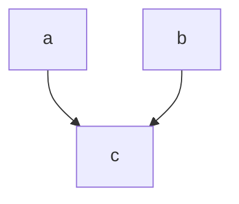
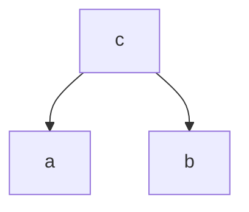
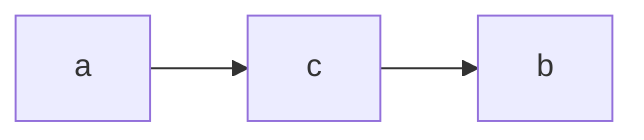

# 人工智能基础考试知识点

* 针对一个现实问题，抽象出搜索问题，并解决(可采纳启发式)
* $\alpha-\beta$剪枝
* 贝叶斯公式
* 贝叶斯网络
  * 节点是否独立/条件独立
  * 计算概率
* 构造决策树——信息增益
* 线性分类模型
* K-means是否收敛

## 人工智能——博弈树算法

### 极小极大算法

假设对方会做出最优决定，算法有时候不能遍历整个树上所有节点，因此此时只能做局部最优搜索

1. 首先确定最大搜索深度D，可能道道最终状态，也可能仅仅为一个中间状态
2. 在最大深度为D的博弈树叶子节点少，使用预定义的价值评价函数对叶子节点剪枝进行评价
3. 自下而上对非叶子节点赋值，max取子节点最大值，min取最小值

扩展到多玩家决策过程中，多玩家决策效用函数返回一个向量即可

### $\alpha-\beta$剪枝

剪枝规则

1. $\alpha$剪枝，如果一个MIN节点的$\beta$值小于或等于它的某一个max祖先节点的$\alpha$值，则剪枝发生在该min节点之下，终止这个min节点以下的搜索过程，这个min节点最终倒退值确定为$\beta$
2. $\beta$剪枝，如果一个MAX节点的$\alpha$值小于或等于它的某一个min祖先节点的$\beta$值，则剪枝发生在该max节点之下，终止这个max节点以下的搜索过程，这个max节点最终倒退值确定为$\alpha$

## 人工智能——逻辑

### 模型与蕴含

* 语义：定义了每个语句关于每个可能世界的真值
* 蕴含$\models$一个语句逻辑上跟随另一个语句而出现$KB\models \alpha$
  * if and only if $\alpha$ is true in all worlds where KB is true
* 模型 m是$\alpha$的一个模型，代表语句$\alpha$在模型m中为真
* $KB\models \alpha$ if and only if $M(KB)\subset M(\alpha)$
  * KB为真的所有模型中$\alpha$为真

### 推理

$KB\vdash _i \alpha$表示**根据算法i可以根据KB导出$\alpha$**

* 可靠性——只导出语义蕴含语句 $whenever \ KB\vdash_i \alpha$,it is also true that $KB\vdash \alpha$
* 完备性——可以生成任意蕴含句$whenever\ KB\vdash \alpha$,it is also true that $KB\vdash_i \alpha$

### 语法及真值表

* 原子语句
* 复合句

### 合法性与可满足性

* 合法性：一个语句是合法的当且仅当这个语句在所有模型中均为真
* 可满足性：一个语句是可满足的当且仅当这个语句在某些模型中为真

### 前向链接与反向链接

#### 霍恩格式

* 霍恩格式是霍恩子句之与
* 霍恩语句
  * 命题符号
  * 命题符号之与=>符号

#### 假言推理

$\alpha_1,\cdots,\alpha_n,\alpha_1\and \cdots\and\alpha_n=>\beta\rightarrow \beta$

#### 前向链接与反向链接

Idea: fire any rule whose premises （前提） are satisfied in the KB, add its conclusion to the KB, until query（询问） is found

### 一阶逻辑的基本概念

1. 常量
2. 谓词——事物之间的关系
3. 函数——事物与事物之间的映射
4. 变量
5. 连接词 $\neg,=>,\and,\or,<=>$
6. 等词=
7. 量词$\forall,\exists$

### 合一

存在某个置换$\theta$使得蕴含的前提和KB中已有的语句完全相同，应用$\theta$后，就可以断言蕴含的结论

最一般合一置换——对变量限制最少

## Bayes Network

### 贝叶斯网络的语义

#### 全局语义

$P(x_1,x_2,\cdots ,x_n)=\prod_{i=1}^n P(x_i|parent(x_i))$

#### 局部语义

给定父节点，一个节点与它的非后代节点是条件独立的

#### 三种网络形式

##### head-to-head-分布独立

$p(a,b,c)=P(a) P(b) P(c)\rightarrow \sum_cP(a,b,c)=\sum_c P(a) P(b) P(c\ |a,b)\rightarrow P(a,b)=P(a)P(b)$

##### tail-to-tail-条件独立

$P(a,b,c)=P(c)P(a\ |c)P(b\ |c)\rightarrow P(a,b\ |c )=P(a\ |c)P(b\ |c)$

##### head-to-tail

$P(a,b,c)=P(a)P(c\ |a)P(b\ |c)->P(a,b\ |c)=P(a\ |c)P(b\ |c)$ head to tail条件独立

## K-means算法是否收敛？

是收敛的，需要证明两点

1. 损失函数单调递减
2. 损失函数有下界

先证明1，为了证明1，我们将算法写成两个部分

初始状态，假设所有数据点$x$被聚类算法聚类为k类，$C_1,C_2,\cdots,C_k$，第$i$类有$N_i$个数据点，计为$C_i(X_1^{C_i},X_2^{C_i},\cdots,X_{N_i}^{C_i})，聚类中心为\mu_i$,此时的损失函数为$J_0(\mu_1,\mu_2,\cdots,\mu_k)=\sum_{i=1}^k \sum_{j=1}^{N_i}(X_j^{C_i}-\mu_i)^2$

* part 1：重新划分类别
* part 2：重新确定聚类中心

part1中，由于我们划分类别的方式是根据最近的方式划分，此时同一类属性中数据点数目发生变化，假设变为$\hat{N_1},\hat{N_2},\cdots,\hat{N_k}$，此时得到的损失函数表示为$J_1(\mu_1,\mu_2,\cdots,\mu_k)=\sum_{i=1}^k \sum_{j=1}^{\hat{N_i}}(X_j^{C_i}-\mu_i)^2$，则显然有$J_1\leq J_0$，这个可以直观地理解为类属性不改变的数据点损失不发生变化，类属性改变的数据点损失必然减小，不然类属性不会发生改变

part2中，我们要证明一个结论

我们有n个数据点$x_1,x_2,\cdots,x_n$，以及一个任意的数据点$\mu$，我们记$\hat{x}=\frac{\sum_{i=1}^n x_i}{n}$，我们旨在证明$$\sum_{i=1}^n (x_i-\mu)^2\geq \sum_{i=1}^n (x_i-\hat{x})^2$$,这是显然的

这个结论告诉我们，一旦形成新的聚类，一类中的新损失将会减少，假设此时的聚类中心为$\hat{\mu_1},\hat{\mu_2},\cdots,\hat{\mu_k}$，损失函数为$J_0(\hat{\mu_1},\hat{\mu_2},\cdots,\hat{\mu_k})=\sum_{i=1}^k\sum_{j=1}^{\hat{N_i}}(x_j^{C_i}-\hat{\mu_i})^2$，显然$J_0(\hat{\mu_1},\hat{\mu_2},\cdots,\hat{\mu_k})\leq J_1(\mu_1,\mu_2,\cdots,\mu_k)$ Q.E.D

