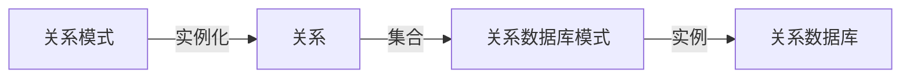
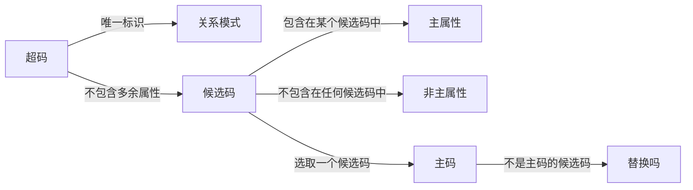

# 数据库期末复习——数据库体系结构&&关系数据模型&&SQL

## 数据库体系结构

### 基本概念

* 类型 && 值
* 模式 && 实例
  * 模式是数据结构和联系(表的结构，字段语义)
  * 实例是某一时刻数据库的状态(表中具体数据取值)
  * 同一模式对应多个实例

### 数据库三级模式结构和二级映像

#### 概念模式->概念视图(概念模式的实例)

* 数据**逻辑结构**特征描述
* 数据记录如何组成，数据项名字、类型、取值范围
* 一个数据库仅有一个概念模式
* 模式DDL Data Definition Language操作模式的数据库语言

#### 外模式->外部视图

* 用户看到的局部数据的逻辑结构和特征描述，数据库系统的对外接口
* 外模式DDL定义

#### 内模式->内部视图

* 记录的物理结构和存储方式
* 不考虑具体设备和物理块大小
* 对于特定数据库是唯一的
* 通过内模式DDL定义

#### 外模式/模式映像

* 定义外模式和概念模式之间的对应关系
  * 模式名不同
  * 外模式属性有模式中多个属性运算得到
* 数据的逻辑独立性：当概念模式发生改变时，只要修改外模式/模式映象，可保持外模式不变，从而保持用户应用程序不变，保证了数据与用户程序的逻辑独立性

#### 模式/内模式映像

* 逻辑记录和字段在内部如何存储
* 数据的物理独立性：当数据库的内部存储结构发生改变时，只要修改模式/内模式映象，可保持概念模式不变，从而保持外模式以及用户程序的不变，保证了数据与程序的物理独立性

## 关系数据模型

### 数据模型

* 数据结构
* 数据操作——数据查询和更新
* 数据的完整性约束——数据间应该具有的约束原则

### 关系模型概论

#### 关系模型

* 二维表格——实体集
  * 属性——表的列 列的数目称为度
  * 元组——表的行 元组的数目称为势或者基数
  * 域——具有相同的数据类型值的集合
  * 关系——元组的集合
* 外码——实体间联系
* 三类完整性规则——数据约束



#### 关系模式的形式化定义

$R(U,D,dom,F)$

* R关系模式名
* U属性集
* D：U中属性值来自的域
* Dom：属性向域的映射集合
* F：属性中的依赖关系

### 超码，候选码，主码

* 超码：能唯一标识一个元组的属性集
* 候选码：不包含多余属性的超码
* 主码



### 关系的性质

* 属性值不可分
* 元组不可重复——至少存在一个候选码
* 行无序
* 列无序

### 三类完整性规则

* 实体完整性：主码所有属性不可取空值
* 参照完整性：参照关系R的任何一个外码值必须
  * 等于被参照关系S中参照的候选码某个值
  * **或者为空**
* 用户自定义完整性

## 关系代数

### 一般形式

Algebra=<A,O>

* A：关系
* O：关系代数运算，满足封闭性

### 原始关系代数

* 选择 $\sigma_F(R)$水平划分关系
* 投影$\pi_A(R)$垂直划分关系
* 自然连接——去掉重复属性
* 积 
* $\Theta$连接——满足某种条件的自然连接做行截断——>等值连接
* 除$\div$ 设关系R的属性集为为{X,Y}，S的属性集为{Y}，则R÷S的结果是一个关系P，P的属性集为{X}，并且P×S包含在R中
* 重命名

### 扩展关系代数

* 扩展投影，投影列表可以包含
  * R的一个属性
  * $x\rightarrow y$,x,y均为属性名，把属性x重命名为y
  * $E\rightarrow z$ E是一个属性表达式，z是表达式生成的新属性名称
* 聚集函数：SUM,COUNT,AVG,MAX,MIN
* 分组，$\gamma_L(R)$,L中只能包含两类对象
  * 分组属性 $\gamma$操作根据某个属性的值将R分组，这个用来分组的属性称为分组属性
  * 聚集函数，应用到关系的某个属性上的聚集函数
* 排序，$\tau_L(R),L=(A_1,A_2,\cdots,A_n)$，优先按照$A_1$排序，随后$A_2,\cdots$
* 赋值，给临时关系变量赋值，使关系代数表达式可以分开写

### 数据更新

* 删除$R\leftarrow R-E$,E是关系代数查询
* 插入$R\leftarrow R\cup E$ E可以是关系代数表达式或者是常量关系
* 修改部分元组$R\leftarrow\pi_{F_1,F_2,\cdots,F_n}(\sigma_p(R))\cup (R-\sigma_p(R))$，修改满足条件P的元组，将其修改$F_1,\cdots,F_n$列

## SQL

### 分类

* DDL定义表、视图、索引
* DML定义操作记录的方式
* DCL定义权限，权限管理

### DML查询

#### 查询基本结构

```sql
select column_list(列名表) from table_list where condition1(指定查询条件) group by group_list(指定分组属性) having condition2(指定分组条件) order by order_list(指定用于排序的列列表);
```

#### select基本查询

* 得到某几列
* 查询全部记录
* 使用表达式，得到特定格式的信息 concat字符串拼接
* 去除重复记录 `distinct`
* 排序 `order by age desc/asc`
* 聚集函数——除聚集函数外的属性必须全部出现在`group by`子句中
* `Having`中必须是聚集函数的表达式

#### 连接查询

* 需要增加连接条件
* 使用表别名

#### 嵌套查询

##### 无关子查询

父查询和子查询相互独立，子查询语句不依赖父查询中返回的任何记录，可以独立执行

##### 相关子查询

* 子查询的结果依赖于父查询的返回值，依赖于外层查询
* `exists (child query)`子查询返回结果非空是为真
* 联机视图，子查询出现在from子句中，可以当成表一样使用

### 查询结果的连接

#### 连接

* Union操作自动去除重复记录——对称差
* Union All操作不去除重复记录

#### 差

Minus

#### 交

Intersect返回两个select结果的元组交集

### 视图

* 定义视图
* 在视图上查询
* 更新视图内容

### 补充语法

* Limit 限制返回前多少行
* All 要求子查询中的所有条件都满足
* Some Any 满足某个条件即可

### 试卷答案

Table 给定下面的基本表： 学生（student）、课程（course）、 系（department）、教师（faculty）和选课（SC）：` student(sid, sname, did)， course(cid, cname, room, fid)， department(did, dname,location)， faculty(fid, fname, sex, did)， SC(sid, cid, score)  `

1. 查询在“3C102”上课的所有姓“赵”的“计算机”系老师姓名；  

```mysql
select fname from (select fname,room from course,faculty where course.fid=faculty.fid) where room='3C102' and fname like '赵%'
```

2. 查询选过课的学生中只选了“张三”老师所授课程的学生学号和姓名；  

```sql
select sid,sname from student where sid in ((select sid from (select count(*) as count_cour,sid from SC) where count_cour=1) Intersects (select sid from SC where sid in (select sid from SC,course,faculty where SC.cid=course.cid and faculty.fid=course.fid and fname='张三'))
```

3. 查询每个系选修了“DB”课程但缺少成绩的学生人数，要求返回两列：一列显示系名称
   （department），另一列显示学生人数，并且查询结果按学生人数降序排列；  

```sql
create view DB as select cid from course where cname='DB';
create view scorenull as select sid from SC where score is null and cid in DB;
create view null_depart as select student.did as did,dname from scorenull,student,department where scorenull.sid=student.sid and department.did=student.did;
create view null_num_depart as select count(*) as count_num,dname from null_depart group by did;
select desc_null_num from null_depart order by count_num desc;
```

4. 查询选修过“DB”和“AI”课程但“DB”课程成绩不低于“AI”成绩的学生学号和姓名；  

```sql
select 
```

